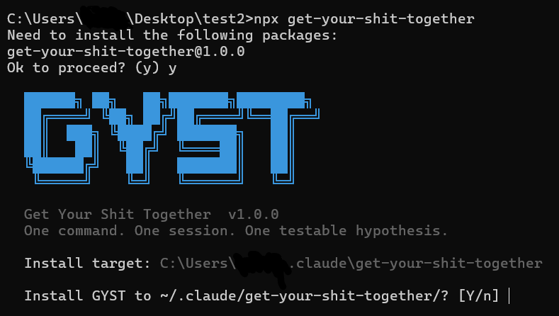

<div align="center">

# Get Your Shit Together (GYST)

[](https://www.npmjs.com/package/get-your-shit-together)
[](https://www.npmjs.com/package/get-your-shit-together)
[](https://github.com/RaphGonz/GYST)
[](https://www.linkedin.com/in/raphael-gonzales-ai-engineer/)
[](LICENSE)

</div>

An interactive wizard for solo entrepreneurs to find solid ideas ! Based on the excellent book "Click" by Jake Knapp and John Zeratsky.


```bash
npx get-your-shit-together
```
<div align="center">

</div>

## Why did I do this

After failing for the fifth time to create a company that makes money or that is somewhat useful to anyone in the world, I decided to work on myself and learn everything again, back to the roots. I stumbled across a book called "Click : Make something people want" and it just blew my mind.

I read it in a morning, and tried to apply the method on a vague idea I had of a start-up. It cleared up so many questions, I thought it was incredible. I finally have something solid to work on and huge motivations to do so !

So the next was simply to make an interactive tool to let anyone create an hypothesis and start working immediatly !

You should read the book [https://www.theclickbook.com/](there) It provides way deeper insights and examples that the wizard simply doesn't provide. It will give you the deeper understanding of what you're doing.

I didn't implement what comes after a foundation sprint. It's all detailed [https://www.thesprintbook.com/](there).

## Who is it for

Solo entrepreneurs, existing companies but also artists or game-designers that want to make money and live from their art. Any solo weirdos. Could also be used in group, if you guys can share a screen.

## What It Does

- Runs the full 4-step Foundation Sprint interactively inside Claude Code
- Researches competitors and validates your target customer's pain using web search
- Guides you through positioning (2x2 matrix) and differentiator selection
- Evaluates multiple solution approaches using four business lenses
- Produces four output files in your project directory: competitor profiles, positioning map, decision journal, and a falsifiable hypothesis

## Requirements

- Node.js >= 16.7.0
- Claude Code (claude.ai/code)

## Install

```bash
# Install via npx (recommended)
npx get-your-shit-together

# Or clone and install locally (for development)
git clone https://github.com/your-repo/GYST
cd GYST
node bin/install.js
```

## Usage

After installing, open any project directory in Claude Code (with full permissions in order to not validate 50 times web searches)
```
claude --dangerously-skip-permissions
```

and run:

```
/gyst:foundation-sprint
```

The sprint runs entirely within your Claude Code session. No account, no API keys, no config.

### 🇫🇷 Run in French

Pass the `-french` flag to run the entire sprint in French — all questions, guidance, and output files will be in French:

```
/gyst:foundation-sprint -french
```

Everything works the same way. Claude switches to a fully pre-translated workflow and writes `COMPETITORS.md`, `HYPOTHESIS.md`, `SPRINT.md`, and `POSITIONING.md` in French.

> Unsupported language flags (e.g. `-spanish`) fall back to English with a message.

## What You Get

Four output files written to your project directory:

- `COMPETITORS.md` — competitor research profiles (written after Step 1)
- `HYPOTHESIS.md` — your testable hypothesis (X/Y/Z/W/U/V format)
- `SPRINT.md` — full decision journal
- `POSITIONING.md` — 2x2 matrix and mini-manifesto

## Install Location

`~/.claude/get-your-shit-together/`

## Uninstall

```bash
rm -rf ~/.claude/get-your-shit-together/
rm -rf ~/.claude/commands/gyst/
```

## License

MIT
