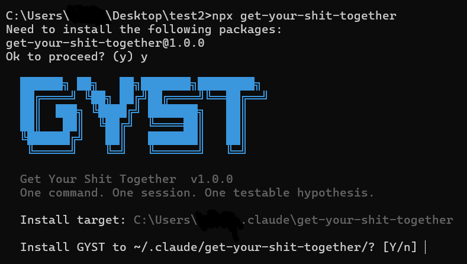

<div align="center">

# Get Your Shit Together (GYST)

[](https://www.npmjs.com/package/get-your-shit-together)
[](https://www.npmjs.com/package/get-your-shit-together)
[](https://github.com/RaphGonz/GYST)
[](https://www.linkedin.com/in/raphael-gonzales-ai-engineer/)
[](LICENSE)

</div>

An interactive wizard for solo entrepreneurs to find solid ideas ! Based on the excellent book "Click" by Jake Knapp and John Zeratsky.


```bash
npx get-your-shit-together
```
<div align="center">

</div>

## Why did I do this

After failing for the fifth time to create a company that makes money or that is somewhat useful to anyone in the world, I decided to work on myself and learn everything again, back to the roots. I stumbled across a book called "Click : Make something people want" and it just blew my mind.

I read it in a morning, and tried to apply the method on a vague idea I had of a start-up. It cleared up so many questions, I thought it was incredible. I finally have something solid to work on and huge motivations to do so !

So the next was simply to make an interactive tool to let anyone create an hypothesis and start working immediatly !

You should read the book [https://www.theclickbook.com/](there) It provides way deeper insights and examples that the wizard simply doesn't provide. It will give you the deeper understanding of what you're doing.

I didn't implement what comes after a foundation sprint. It's all detailed [https://www.thesprintbook.com/](there).

## Who is it for

Solo entrepreneurs, existing companies but also artists or game-designers that want to make money and live from their art. Any solo weirdos. Could also be used in group, if you guys can share a screen.

## What It Does

- Runs the full 4-step Foundation Sprint interactively inside Claude Code
- Researches competitors and validates your target customer's pain using web search
- Guides you through positioning (2x2 matrix) and differentiator selection
- Evaluates multiple solution approaches using five business lenses (the 5PM framework)
- Produces five output files in your project directory: competitor profiles, positioning map, decision journal, falsifiable hypothesis, and a 5PM Scorecard

## The 5PM Framework

The sprint evaluates your idea across five lenses to surface signal before you build.

- **Problem** — Is this problem important AND urgent for the target customer? Vitamin vs. aspirin classification drives the whole sprint. A true aspirin solves something people are already actively trying to fix; a vitamin is nice to have but rarely purchased.
- **Purchaser** — Who actually pays? This lens looks at tech adoption readiness, willingness to pay, and whether the buyer is B2C, B2A (aspirational — photographers, podcasters), B2B, or B2E. The buyer shapes every pricing and distribution decision downstream.
- **Pricing Model** — What revenue shape does this business naturally take? Assessed qualitatively — subscription dynamics, ARPA range, and billing cadence signals tell you whether the unit economics make sense before you write a line of code.
- **Market** — Is the market reachable and growing? AI performs a live web search for community size, job board volume, and conference activity to ground your estimate in current evidence rather than assumptions.
- **Product/Founder Fit** — Are you the right person to build this? Background, network, market access, and the passion check ("Do you love this problem?") determine whether you have an unfair advantage or are starting from scratch in a market you barely know.

At sprint end the AI writes a `5PM-SCORECARD.md` with a FAVORABLE / CAUTION / UNFAVORABLE verdict per lens, with evidence and rationale.

## Need Intensity

Need Intensity measures how strongly a market actually needs a solution — not whether your idea is clever, but whether the pain is deep enough to drive purchasing behavior.

- **Real** — Is there documented evidence that people are actively trying to solve this? Are there communities, job postings, conferences, or tools dedicated to this problem?
- **Urgent** — Do people need a solution now, not eventually? Time pressure signals willingness to pay today.
- **Critical** — How severe is the consequence of NOT solving it? Loss of income, health risk, and regulatory exposure score higher than inconvenience.
- **Imposed** — Is the need externally mandated — by law, employer, or market standard? External mandate removes the "nice to have" objection.
- **Neglected** — How thin is the existing solution landscape? A crowded market with dominant players scores low; whitespace scores high.
- **Consciousness** — Does the target customer already know they have this problem? Aware buyers need less education before they convert.

The score is calculated as:

```
Score = Neglected × (Critical + Consciousness) × (Urgent + Imposed + Real)
```

Each dimension is rated 0–10 (calibrated by AI web search). Maximum score: 6,000.

| Score | Label |
|-------|-------|
| 4,000 – 6,000 | Burning need — strong market signal |
| 2,500 – 3,999 | Solid need — viable if execution is sharp |
| 1,000 – 2,499 | Moderate need — segment or reframe before building |
| 500 – 999 | Weak need — advisory: consider a tighter client definition |
| 0 – 499 | Minimal need — significant risk, revisit problem statement |

When the score falls below 1,000, the AI suggests two more precise client segments or problem reframings — you decide whether to re-rate or proceed.

## Requirements

- Node.js >= 16.7.0
- Claude Code (claude.ai/code)

## Install

```bash
# Install via npx (recommended)
npx get-your-shit-together

# Or clone and install locally (for development)
git clone https://github.com/your-repo/GYST
cd GYST
node bin/install.js
```

## Usage

After installing, open any project directory in Claude Code (with full permissions in order to not validate 50 times web searches)
```
claude --dangerously-skip-permissions
```

and run:

```
/gyst:foundation-sprint
```

The sprint runs entirely within your Claude Code session. No account, no API keys, no config.

### Run in another language

Pass a language flag to run the sprint in your language — all questions, guidance, and output files will be translated:

| Flag | Language |
|------|----------|
| `-french` | 🇫🇷 French / Français |
| `-spanish` | 🇪🇸 Spanish / Español |
| `-german` | 🇩🇪 German / Deutsch |
| `-chinese` | 🇨🇳 Chinese / 中文 |
| `-portuguese` | 🇧🇷 Portuguese / Português |
| `-japanese` | 🇯🇵 Japanese / 日本語 |

```
/gyst:foundation-sprint -french
```

Claude switches to a fully pre-translated workflow and writes `COMPETITORS.md`, `HYPOTHESIS.md`, `SPRINT.md`, `POSITIONING.md`, and `5PM-SCORECARD.md` in the chosen language.

> Unsupported flags fall back to English with a message.

## What You Get

Five output files written to your project directory:

- `COMPETITORS.md` — competitor research profiles (written after Step 1)
- `HYPOTHESIS.md` — your testable hypothesis (X/Y/Z/W/U/V format)
- `SPRINT.md` — full decision journal
- `POSITIONING.md` — 2x2 matrix and mini-manifesto
- `5PM-SCORECARD.md` — 5PM framework scorecard with verdicts across all five lenses

## Install Location

`~/.claude/get-your-shit-together/`

## Uninstall

```bash
rm -rf ~/.claude/get-your-shit-together/
rm -rf ~/.claude/commands/gyst/
```

## License

MIT
